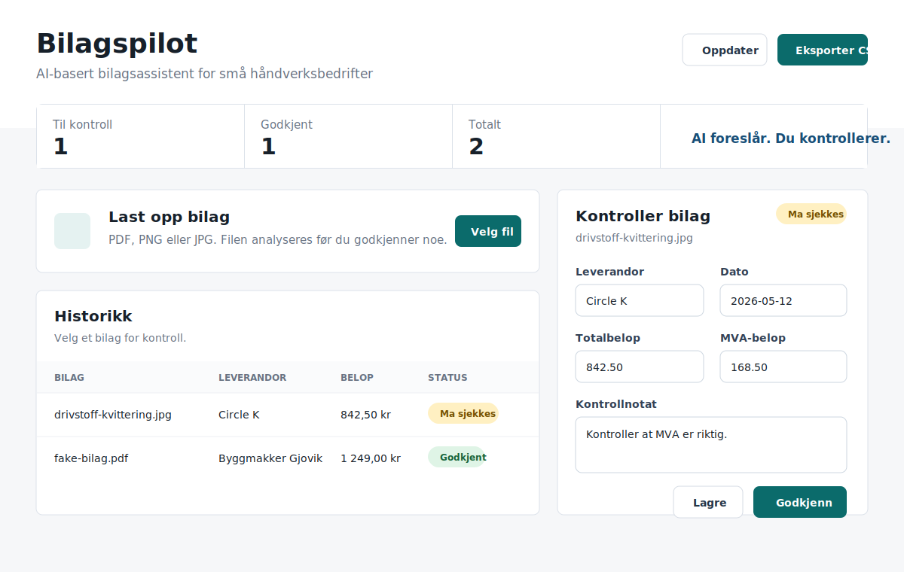

# Bilagspilot

**AI-basert bilagsassistent for små håndverksbedrifter**

Bilagspilot er et porteføljeprosjekt som viser hvordan AI kan spare tid i første del av bilagsarbeid. Appen leser fakturaer og kvitteringer, foreslår nøkkelfelt, lar brukeren kontrollere og rette data, og eksporterer godkjente bilag til CSV.

Dette er en demo, ikke et godkjent regnskapssystem.

## Skjermbilde



## Hva appen gjør

- Laster opp PDF, PNG og JPG.
- Bruker OpenAI Vision/API til å hente ut leverandør, dato, totalbeløp, MVA, valuta, bilagsnummer og kategori.
- Viser resultatet i et redigerbart skjema.
- Merker bilag som `OK`, `Må sjekkes` eller `Mangler data`.
- Lagrer godkjente bilag i SQLite.
- Eksporterer godkjente bilag til CSV.

## Tech stack

- Backend: Python, FastAPI, SQLite
- Frontend: React, Vite, TypeScript
- AI: OpenAI Responses API med bilde/PDF-input
- Eksport: CSV

## Klon repoet

```bash
git clone https://github.com/wessel05j/bilagspilot.git
```

## Kjør backend

Backend kjøres i egen terminal. Kjør kommandoen fra mappen der du klonet repoet. Bash-kommandoen fungerer på Linux/macOS og i Git Bash på Windows:

```bash
cd bilagspilot/backend &&
python3 -m venv .venv &&
source .venv/bin/activate &&
pip install -r requirements.txt &&
cp -n .env.example .env &&
uvicorn app.main:app --reload
```

Windows PowerShell:

```powershell
cd bilagspilot\backend
py -m venv .venv
.\.venv\Scripts\activate
pip install -r requirements.txt
copy .env.example .env
uvicorn app.main:app --reload
```

Legg inn din egen API-nøkkel i `backend/.env`:

```env
OPENAI_API_KEY=your_key_here
```

Backend kjører på `http://localhost:8000`.

## Kjør frontend

Frontend kjøres i en annen terminal. Kjør kommandoen fra mappen der du klonet repoet:

```bash
cd bilagspilot/frontend &&
npm install &&
npm run dev
```

Frontend kjører på `http://localhost:5173`.

## Demo-flyt

1. Start backend og frontend.
2. Åpne `http://localhost:5173`.
3. Last opp et falskt bilag, for eksempel `demo/fake-bilag.pdf`.
4. Kontroller feltene AI foreslår.
5. Rett eventuelle feil.
6. Trykk `Godkjenn`.
7. Trykk `Eksporter CSV`.

## Tester

Backend:

```bash
cd backend
pytest
```

Frontend:

```bash
cd frontend
npm test
npm run build
```

## Miljøvariabler

Backend bruker `backend/.env` lokalt. Eksempel ligger i `backend/.env.example`.

Viktige variabler:

- `OPENAI_API_KEY`
- `OPENAI_MODEL`
- `DATABASE_URL`
- `UPLOAD_DIR`
- `FRONTEND_ORIGIN`

Frontend kan bruke `frontend/.env` hvis API-adressen skal endres:

```env
VITE_API_BASE_URL=http://localhost:8000
```

## Sikkerhet og personvern

- Ikke commit `.env`.
- Ikke commit `uploads/`.
- Ikke commit lokal SQLite-database.
- Ikke bruk ekte kundedata eller ekte bilag i demo.
- Bruk bare syntetiske testbilag.

## Begrensninger

- Appen er ikke et regnskapssystem.
- AI-forslag må alltid kontrolleres av et menneske.
- CSV-eksporten er enkel og laget for demo/portefølje.
- Det finnes ikke innlogging eller rollebasert tilgang ennå.

## Lisens

MIT

## Videre arbeid

- Excel-eksport.
- Bedre håndtering av flere sider og store PDF-er.
- Innlogging.
- Flere kategorier og regler per bedrift.
- Bedre revisjonsspor for manuelle endringer.
